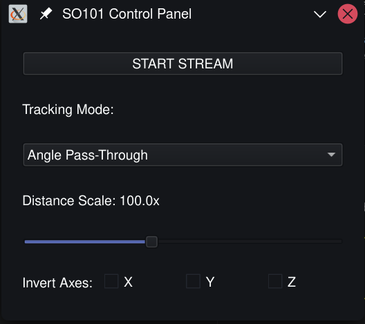
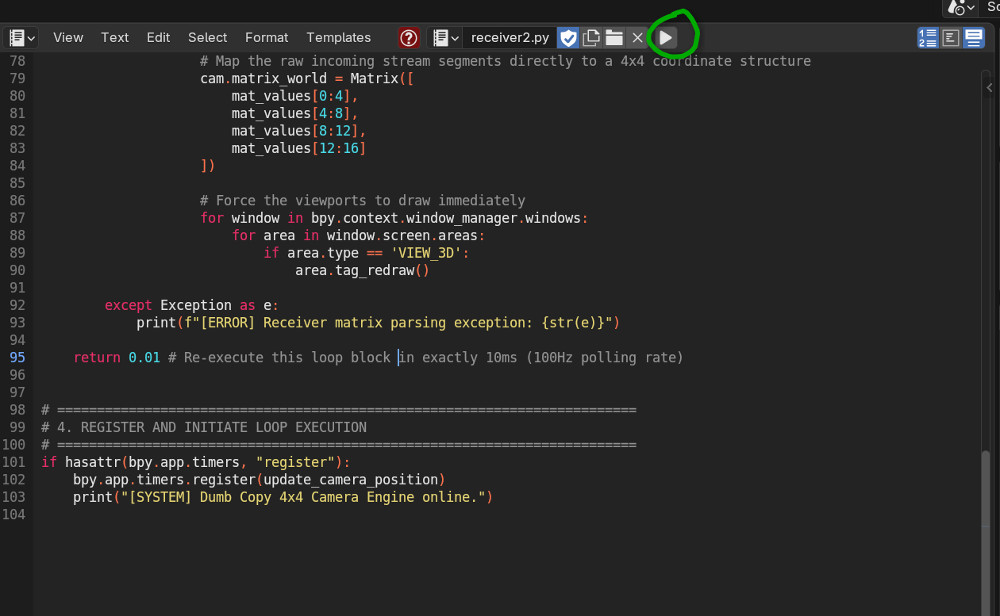
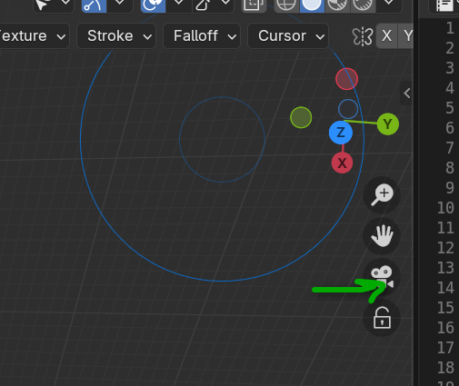

# Demo - SO-101 Open Arm (leader) as a Blender Controller

https://github.com/user-attachments/assets/23aaf50b-51aa-495b-b908-11ef2129ca8d

This is a very simple proof of concept human/computer interface. It uses the SO-101 robotic arm (leader) as a camera controller for Blender.

It is an AI generated, human debugged script. (Geometry still challenges AI code generation.) This document and the install files are human authored.

The SO-101 as a camera controller is very natural to use. It is readily available and a full build (servos/chips/prints/peripherals) can be acquired for under $250.

#### Limitations
- UI to control depth, you could use the claw.
- No way to shift origin.

### Structure
- `receiver.py` goes in Blender
- `sender.py` run from the command line reads the ARM.
- utilizies native kinematics for the SO-101 to compute position/heading.

### Setup
- Enter the project directory
- Install `lerobot` and profiles following https://huggingface.co/docs/lerobot/en/installation.
```
uv venv
source .venv/bin/activate
uv sync
```

- Install kinematics definitions for the SO-101.
```bash
git clone https://github.com/TheRobotStudio/SO-ARM100.git
```

- Start the script
```bash
lerobot-find-port
# e.g., /dev/ttyACM0

python sender.py /dev/ttyACM0
```

- The UI will pop up. Click "Start Stream"



- In Blender, open the Scripting tab, and open `receiver.py`.
- Click Run.



- The robot arm should now control the camera. Make sure to focus the camera.


### Troubleshooting
- If I missed a package in the .toml install, it is very likely.
